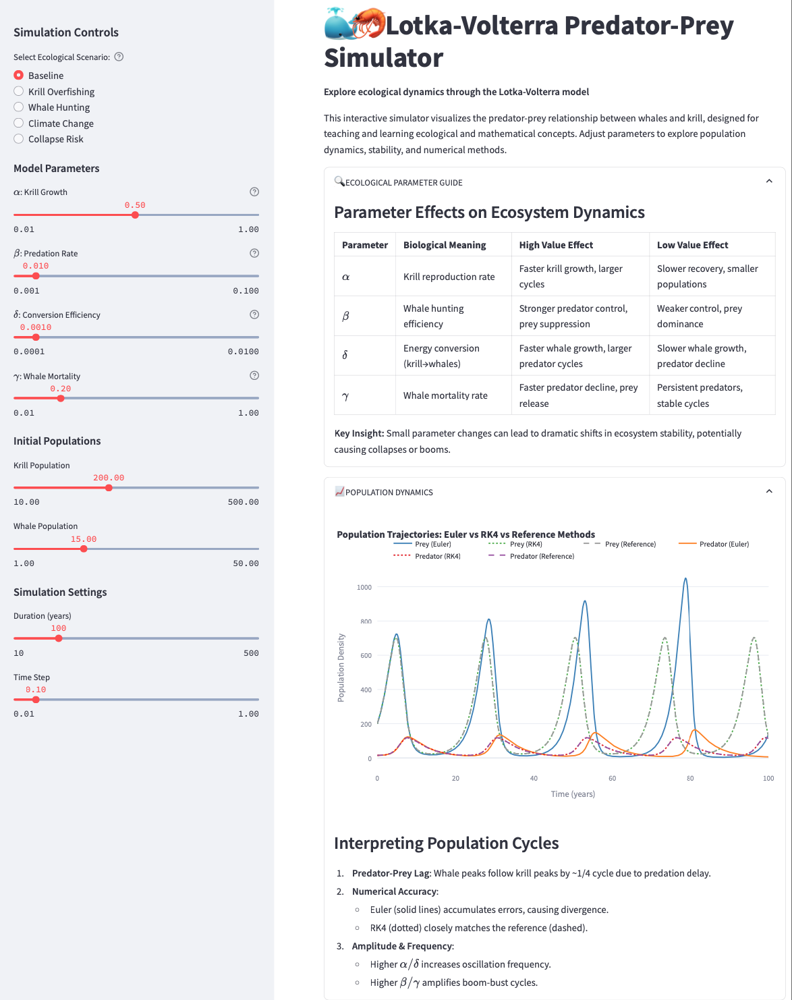

# Study of Lotka Volterra Model

## Project Description

The Lotka-Volterra Predator-Prey Simulator is an interactive Python-based educational tool designed to model and visualize the ecological dynamics between predator (whales) and prey (krill) populations using the Lotka-Volterra differential equations. Built with Streamlit, it provides an intuitive interface for users to adjust parameters, explore numerical methods, and analyze system stability, making it ideal for students and educators in computational mathematics and ecology.

## Table of Contents

- [Installation](#installation)
- [Usage](#usage)
- [Features](#features)
- [Methodology](#methodology)
- [Examples](#examples)
- [References](#references)
- [Dependencies](#dependencies)
- [Algorithms/Mathematical Concepts Used](#algorithmsmathematical-concepts-used)
- [License](#license)
- [Acknowledgments](#acknowledgments)
- [Note](#note)

---

## Installation

To set up the project locally, follow these steps:

1. **Install Dependencies**:
   Install the required Python packages using pip:
   ```bash
   pip install -r requirements.txt
   ```

2. **Set Up Requirements File**:
   Create a `requirements.txt` file with the following content:
   ```text
   numpy
   scipy
   streamlit
   plotly
   pandas
   ```

3. **Run the Application**:
   Launch the Streamlit app:
   ```bash
   streamlit run study_of_lotka_volterra_model.py
   ```

4. **Optional: MathJax for LaTeX Rendering**:
   The app uses MathJax for rendering mathematical equations. Ensure an internet connection for MathJax to load correctly, as it is sourced via CDN.

## Usage

1. **Launch the App**:
   After installation, run the Streamlit app as described above. The app will open in your default web browser.

2. **Interact with the Interface**:
   - Use the sidebar to select ecological scenarios (e.g., "Baseline," "Krill Overfishing").
   - Adjust parameters (α, β, δ, γ) using sliders to explore their impact on population dynamics.
   - Set initial populations for krill and whales.
   - Configure simulation duration and time step.

3. **Explore Visualizations**:
   - View population trajectories, phase portraits, direction fields, numerical errors, cross-correlation, and stability analysis.
   - Expand sections for detailed interpretations and mathematical references.

## Features

- **Interactive Interface**: Streamlit-based app for real-time parameter adjustments and visualizations.
- **Multiple Numerical Methods**: Implements Euler, RK4, and LSODA solvers for solving differential equations.
- **Comprehensive Visualizations**: Includes population trajectories, phase portraits, direction fields, error analysis, cross-correlation, and eigenvalue plots.
- **Stability Analysis**: Computes equilibrium points and their stability using Jacobian eigenvalues.
- **Educational Content**: Detailed explanations of ecological and mathematical concepts, including a parameter guide and mathematical reference.
- **Unit Tests**: Ensures reliability of core computations.

## Methodology

The simulator follows a structured process to model and analyze predator-prey dynamics:

1. **Initialization**:
   - The `LotkaVolterraSimulator` class is instantiated with default parameters (α, β, δ, γ) and initial conditions (krill: 200, whales: 15).
   - Pre-defined ecological scenarios are loaded for quick experimentation.

2. **Parameter Configuration**:
   - Users adjust parameters via the Streamlit interface, updating the simulator's parameters and clearing cached Jacobian calculations.

3. **Numerical Integration**:
   - The system solves the Lotka-Volterra equations using one of three methods:
     - **Euler**: First-order method, simple but less accurate.
     - **RK4**: Fourth-order Runge-Kutta, highly accurate for smooth solutions.
     - **LSODA**: Adaptive, high-precision reference solver from SciPy.

4. **Analysis**:
   - **Equilibria**: Computes equilibrium points (extinction and coexistence).
   - **Stability**: Analyzes stability via Jacobian eigenvalues.
   - **Cross-Correlation**: Measures temporal lag between predator and prey cycles.

5. **Visualization**:
   - Generates interactive Plotly figures for population dynamics, phase portraits, direction fields, error analysis, cross-correlation, and eigenvalue plots.
   - Displays a stability table summarizing equilibrium points and their properties.

6. **Output**:
   - Results are displayed in expandable Streamlit sections with detailed interpretations, enabling users to explore ecological and numerical insights.

## Examples

### Sample Input

- **Scenario**: Baseline
- **Parameters**: $α$ = 0.5, $β$ = 0.01, $δ$ = 0.001, $γ$ = 0.2
- **Initial Conditions**: Krill = 200, Whales = 15
- **Simulation Settings**: Duration = 100 years, Time Step = 0.1

### Sample Output

- **Population Trajectories**: Oscillatory cycles with krill peaking before whales.
- **Phase Portrait**: Closed orbits indicating neutral stability.
- **Stability Analysis**:
  - Equilibrium $(0, 0)$: Saddle Point (unstable).
  - Equilibrium $(γ/δ, α/β)$: Neutrally Stable (Center).
- **Cross-Correlation**: Peak at ~1/4 cycle lag, showing predators follow prey.

### Sample User Interface

| *Sample of Web UI* |
|:--:| 
|  |

## References

- Lotka, A. J. (1925). *Elements of Physical Biology*. Williams & Wilkins.
- Volterra, V. (1926). "Fluctuations in the Abundance of a Species considered Mathematically." *Nature*, 118, 558–560.
- Murray, J. D. (2002). *Mathematical Biology I: An Introduction*. Springer.
- Press, W. H., et al. (2007). *Numerical Recipes: The Art of Scientific Computing*. Cambridge University Press.

## Dependencies

- **Python**: 3.8+
- **NumPy**: Array operations and mathematical computations.
- **SciPy**: Numerical integration (solve_ivp, LSODA), eigenvalue analysis, and signal processing.
- **Streamlit**: Interactive web application framework.
- **Plotly**: Interactive visualizations.
- **Pandas**: Data handling for stability table.
- **MathJax**: LaTeX rendering for equations (loaded via CDN).

## Algorithms/Mathematical Concepts Used

- **Lotka-Volterra Equations**:
  - Coupled nonlinear ODEs modeling predator-prey interactions:
    $\frac{dx}{dt} = \alpha x - \beta xy, \quad \frac{dy}{dt} = \delta xy - \gamma y$
  - Represents exponential growth, predation, conversion, and mortality.

- **Numerical Methods**:
  - **Forward Euler**: First-order method with error $\(O(\Delta t)\)$.
  - **Runge-Kutta 4 (RK4)**: Fourth-order method with error $\(O(\Delta t^4)\)$.
  - **LSODA**: Adaptive solver combining Adams and BDF methods for high precision.

- **Stability Analysis**:
  - **Jacobian Matrix**: Linearizes the system at equilibrium points:
      <pre>
        J = [ ∂f₁/∂x   ∂f₁/∂y ] = [ α   - βy -βx ]
            [ ∂f₂/∂x   ∂f₂/∂y ]   [ δy    δx - γ ] </pre>
      
  - **Eigenvalues**: Determines stability (stable if $\(\Re(\lambda) < 0\)$, unstable if $\(\Re(\lambda) > 0\)$, neutral if $\(\Re(\lambda) = 0\))$.

- **Phase Space Analysis**:
  - Nullclines $(\(y = \alpha/\beta\)$, $\(x = \gamma/\delta\))$ identify equilibrium points.
  - Closed orbits indicate periodic solutions.

- **Cross-Correlation**:
  - Uses FFT-based correlation to measure lag between predator and prey cycles.
  - Applies Tukey window to reduce edge effects.

- **Visualization Techniques**:
  - Plotly for interactive plots.
  - Gaussian filtering and peak detection for cross-correlation analysis.

## License

This project is licensed under the MIT License - see the [LICENSE](LICENSE) file for details.

## Acknowledgments

- Inspired by classic ecological models by Lotka and Volterra.
- Built using open-source libraries: NumPy, SciPy, Streamlit, and Plotly.
- Thanks to the computational mathematics community for feedback on numerical methods.

## Note

| AI was used to generate most of the docstrings and inline comments in the code. |
|:--:|
